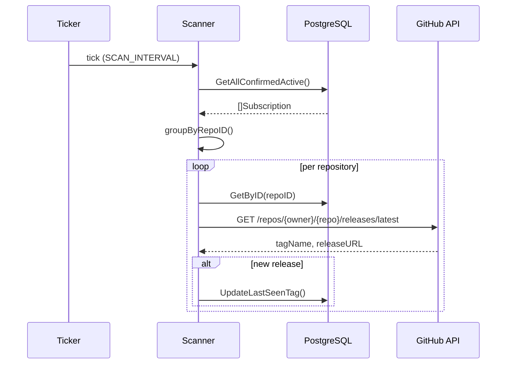
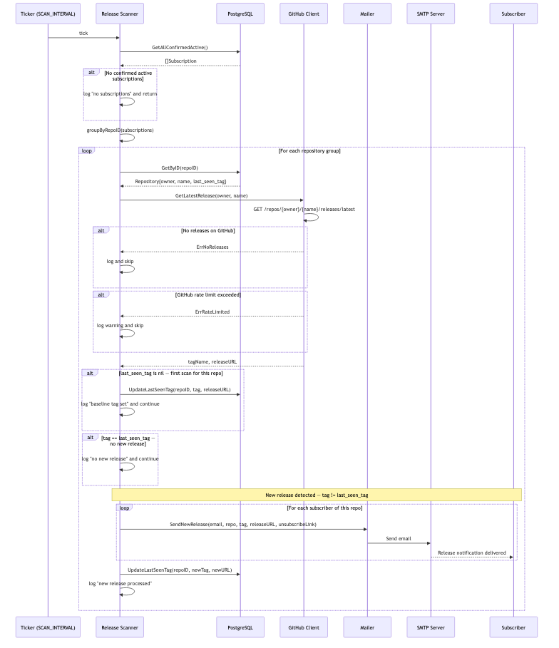

# [ADR] Release Detection Strategy — Polling vs GitHub Webhooks

| | |
|---|---|
| **Status** | Proposed \| **Accepted** \| Rejected \| Obsolete |
| **Author(s)** | Daria Ukshe |
| **Collaborators** | |
| **Created at** | 09 May 2025 |
| **Review deadline** | |
| **Approved at** | |
| **Epic** | CaseTaskNotifier — GitHub Release Notification Service |

---

## Context

CaseTaskNotifier needs to detect when a new release is published on a GitHub repository and notify all confirmed subscribers by email.

There are two primary approaches to detecting new GitHub releases:

1. **Polling** — the service periodically calls the GitHub REST API (`GET /repos/{owner}/{repo}/releases/latest`) for each tracked repository and compares the result against the last known tag stored in the database.
2. **GitHub Webhooks** — GitHub pushes a `release` event to a registered HTTP endpoint whenever a new release is published in a repository.

The choice between these approaches has significant implications for infrastructure complexity, operational requirements, and notification latency.

There are several constraints to consider:

1. The service tracks repositories on behalf of arbitrary subscribers — it does not own those repositories and cannot install webhooks on them without repository admin rights.
2. GitHub webhooks require a publicly accessible HTTPS endpoint with a valid TLS certificate for webhook delivery.
3. GitHub's REST API enforces rate limits: 5,000 authenticated requests per hour per token, or 60 unauthenticated.
4. The system must remain operational and not crash when GitHub is temporarily unavailable or rate-limited.

---

## Overview

### Current Implementation — Release Scanner

The release scanner (`internal/scanner/scanner.go`) runs as a background goroutine, started at application boot. It fires immediately on startup and then on every `SCAN_INTERVAL` tick (configurable via environment variable).

**Scan cycle steps:**

1. Fetch all confirmed and active subscriptions from the database in a single query.
2. Group subscriptions by `repository_id` — this ensures **one GitHub API call per repository per cycle**, not one per subscriber.
3. For each repository group:
   - Fetch the latest release via `GET /repos/{owner}/{repo}/releases/latest`.
   - If `last_seen_tag` is `NULL` (first scan) — store the current tag as a baseline without sending notifications.
   - If `last_seen_tag` equals the fetched tag — no new release, skip.
   - If tags differ — send email notifications to all subscribers of that repository, then update `last_seen_tag` in the database.
4. Handle errors gracefully: `ErrNoReleases` and `ErrRateLimited` are logged and the repository is skipped without crashing the cycle.

**Architecture diagram of the Release Scanner:**

**Rate limit exposure:**

With a 5-minute scan interval and 500 tracked repositories, the scanner generates **6,000 GitHub API requests per hour**, which exceeds the 5,000/hour authenticated limit. The scanner handles `ErrRateLimited` by logging and skipping affected repositories until the next cycle.

### Alternative — GitHub Webhooks

With webhooks, GitHub would `POST` a `release` event payload to a registered endpoint on every new release. The service would receive the push in real time without polling.

This approach would require:

- A publicly accessible HTTPS endpoint (requires domain name + TLS certificate).
- Webhook registration on each tracked repository via the GitHub API (`POST /repos/{owner}/{repo}/hooks`) — which requires `admin:repo_hook` permission, i.e., the repository owner must grant access.
- A webhook secret for payload signature verification.
- An event queue or deduplication mechanism to handle retries and duplicate deliveries from GitHub.

Since CaseTaskNotifier tracks repositories owned by arbitrary users, webhook installation is not possible without those users granting admin access — which is outside the scope of a subscription-based notification service.

---

## Decisions

Since the service tracks repositories owned by arbitrary third parties, GitHub Webhooks are not a viable option without requiring repository admin access from every subscriber. Three options were considered:

**Option A — Polling with a background scanner (chosen)**

Implement a background goroutine that polls the GitHub REST API on a configurable interval (`SCAN_INTERVAL`). Subscriptions are grouped by repository so that exactly one API call is made per repository per cycle, regardless of subscriber count. The last known release tag is stored in the `repositories.last_seen_tag` column and compared against the freshly fetched tag on each cycle. If a difference is detected, all confirmed subscribers of that repository are notified and the stored tag is updated.

Upsides: no external infrastructure required; works for any repository without needing owner consent; operationally simple to deploy and reason about; fault-tolerant by design — rate-limit and no-release errors are handled per-repository without aborting the entire scan cycle.

Downsides: notification latency is bounded by the scan interval, not real time; GitHub API rate limits (5,000 req/hour per authenticated token) cap the number of trackable repositories — at a 5-minute interval the practical ceiling is ~416 repositories before hitting the limit; the service continuously consumes API quota even when no new releases have been published.

**Option B — GitHub Webhooks**

Register a `release` event webhook on each tracked repository via `POST /repos/{owner}/{repo}/hooks`. GitHub would push a payload to the service's endpoint on every new release, eliminating the need to poll.

Upsides: real-time notifications with zero polling overhead; no GitHub API quota consumed during idle periods.

Downsides: webhook registration requires the `admin:repo_hook` permission on each repository — meaning every subscriber would need to grant admin access to their repository, which is not acceptable for a general-purpose notification service where users subscribe to repositories they do not own. Additionally, this approach requires a publicly accessible HTTPS endpoint with a valid TLS certificate, webhook secret management, idempotent event handling (GitHub retries failed deliveries), and deduplication logic for duplicate payloads. The operational complexity is significantly higher.

**Option C — Hybrid (polling as default + webhooks for opted-in repository owners)**

Use polling as the baseline detection mechanism for all repositories. Allow repository owners who install a GitHub App to opt into real-time webhook delivery, removing those repositories from the polling cycle.

Upsides: real-time notifications for opted-in repos; polling remains as a universal fallback.

Downsides: requires building and maintaining a GitHub App (OAuth flow, app registration, installation tokens, webhook secret rotation) alongside the existing polling infrastructure — effectively two separate code paths for release detection. The added complexity and infrastructure overhead are not justified at the current scale of the service, where releases are infrequent events and a sub-10-minute notification latency is acceptable.

### Decision

It was decided to go with **Option A**. It is the only approach that works universally — without requiring repository admin access from subscribers or any action from repository owners. The operational simplicity, zero external infrastructure requirements, and acceptable notification latency make it the right fit for the current scale and use case. Options B and C were ruled out primarily because webhook registration on third-party repositories is not feasible without admin consent, and the additional complexity they introduce is not justified by the marginal improvement in notification latency.

---

## Consequences

1. Notification latency is non-zero — users receive notifications within one `SCAN_INTERVAL` of a new release being published, not in real time.
2. GitHub API rate limits cap the number of trackable repositories at a given scan interval. With a 5-minute interval, the practical limit is ~416 repositories per authenticated token before hitting the 5,000 req/hour ceiling.
3. The scanner is resilient — `ErrRateLimited` and `ErrNoReleases` are handled gracefully; a failure for one repository does not abort the scan cycle for others.
4. No external infrastructure is required — no public domain, TLS certificate, webhook secret management, or event queue.
5. The `last_seen_tag` column on the `repositories` table serves as the single source of truth for change detection, keeping the data model simple.
6. Future migration to webhooks (e.g., via a GitHub App) remains possible — the `Scanner` is behind a goroutine boundary and the notification logic is reusable.

---

## Infrastructure

1. Background goroutine started at application boot (`app.go`).
2. `SCAN_INTERVAL` environment variable controls polling frequency.
3. `GITHUB_TOKEN` environment variable raises the rate limit from 60 to 5,000 req/hour — required for any meaningful number of tracked repositories.
4. `repositories.last_seen_tag` column stores the last detected release tag per repository.
5. No additional infrastructure components introduced.

