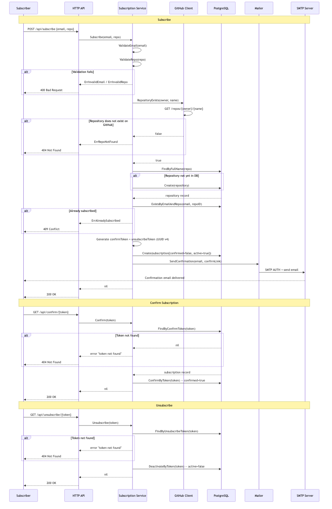

# [ADR] Double Opt-In Subscription Confirmation

| | |
|---|---|
| **Status** | Proposed \| **Accepted** \| Rejected \| Obsolete |
| **Author(s)** | Daria Ukshe |
| **Collaborators** | |
| **Created at** | 09 May 2025 |
| **Review deadline** | |
| **Approved at** | |
| **Epic** | CaseTaskNotifier — GitHub Release Notification Service |

---

## Context

When a user submits their email to subscribe to a GitHub repository, the system must decide when to activate that subscription and begin sending notifications.

There are two primary concerns:

1. **Email ownership** — anyone can submit any email address in a `POST /api/subscribe` request. Without verification, a malicious actor could subscribe third-party email addresses to unwanted notifications.
2. **Spam prevention** — unverified subscriptions would allow the service to be used as a spam relay, sending unsolicited release notifications to arbitrary recipients.

The choice of confirmation strategy directly affects the data model (additional columns and tokens in the `subscriptions` table), the subscription flow complexity, and the security guarantees the service provides.

---

## Overview

### Current Implementation — Double Opt-In

When a subscription request is received, the system creates a subscription record with `confirmed = false` and generates two UUID tokens:

- `confirm_token` — sent to the user's email as a one-time confirmation link
- `unsubscribe_token` — included in every notification email for future opt-out

The subscription is only activated (`confirmed = true`) when the user clicks the confirmation link at `GET /api/confirm/{token}`. Until confirmed, the subscription is excluded from the scanner's query (`GetAllConfirmedActive`) and no release notifications are sent.

**Subscription confirmation flow:**



The `subscriptions` table schema reflects this approach:

```sql
confirmed         BOOLEAN NOT NULL DEFAULT FALSE,
active            BOOLEAN NOT NULL DEFAULT TRUE,
confirm_token     TEXT UNIQUE NOT NULL,
unsubscribe_token TEXT UNIQUE NOT NULL,
```

A unique index on `(email, repository_id)` prevents duplicate subscription records for the same email and repository combination.

### Alternative — Single Opt-In

Activate the subscription immediately upon `POST /api/subscribe` without requiring email confirmation. Release notifications begin with the next scan cycle.

---

## Decisions

**Option A — Double opt-in with email confirmation (chosen)**

Create the subscription in a pending state. Send a confirmation email with a unique token link. Activate the subscription only after the user clicks the link. Include a unique unsubscribe token in every notification email.

Upsides: guarantees the subscriber owns the email address; prevents the service from being used to spam arbitrary recipients; unsubscribe link in every email gives users a clear and immediate opt-out path; aligns with standard email marketing practices and anti-spam regulations (CAN-SPAM, GDPR).

Downsides: adds friction to the subscription flow — the user must take an extra step before receiving notifications; requires storing two additional token columns per subscription; a missed or filtered confirmation email results in an inactive subscription with no automatic retry.

**Option B — Single opt-in (immediate activation)**

Activate the subscription immediately on `POST /api/subscribe`. No confirmation email is sent.

Upsides: simpler flow — one step to subscribe; no extra columns or token management needed.

Downsides: no proof of email ownership — any email address can be subscribed without consent; the service can trivially be abused to send unsolicited notifications to third-party email addresses; increases risk of the service's IP/domain being flagged as a spam source.

**Option C — OAuth / third-party identity verification**

Require users to authenticate via GitHub OAuth or another identity provider before subscribing. Email is taken from the verified identity.

Upsides: strongest guarantee of identity — no separate email verification needed.

Downsides: significantly increases implementation complexity (OAuth flow, session management, token refresh); introduces a dependency on a third-party identity provider; creates unnecessary friction for a simple notification service where users may want to use a different email than their GitHub account.

### Decision

It was decided to go with **Option A**. Double opt-in is the correct default for any service that sends emails to user-provided addresses. It provides proof of email ownership with minimal implementation cost — two UUID columns and one additional HTTP endpoint. The friction of confirming via email is standard and expected by users of notification services. Options B and C were ruled out: B lacks basic abuse protection, and C introduces disproportionate complexity for the scope of this service.

---

## Consequences

1. Every subscription starts in a pending state (`confirmed = false`) and is excluded from the scanner until confirmed — no accidental notifications are sent to unverified addresses.
2. The `subscriptions` table carries two additional columns (`confirm_token`, `unsubscribe_token`) and a unique index on `(email, repository_id)`.
3. The subscription service sends two types of transactional emails: confirmation (on subscribe) and release notification (on new release). Both are handled by the `Mailer` interface.
4. A user who does not confirm their subscription will remain in a pending state indefinitely — there is no automatic expiry or retry mechanism in the current implementation.
5. The unsubscribe token included in every notification email allows one-click opt-out without requiring authentication.

---

## Infrastructure

1. `confirm_token` and `unsubscribe_token` UUID columns added to the `subscriptions` table (migration `000001_init.up.sql`).
2. `GET /api/confirm/{token}` endpoint added to the HTTP router.
3. `GET /api/unsubscribe/{token}` endpoint added to the HTTP router.
4. `Mailer.SendConfirmation` method sends the confirmation link.
5. Scanner uses `GetAllConfirmedActive()` — filters to `confirmed = true AND active = true` — ensuring unconfirmed subscriptions never receive notifications.
