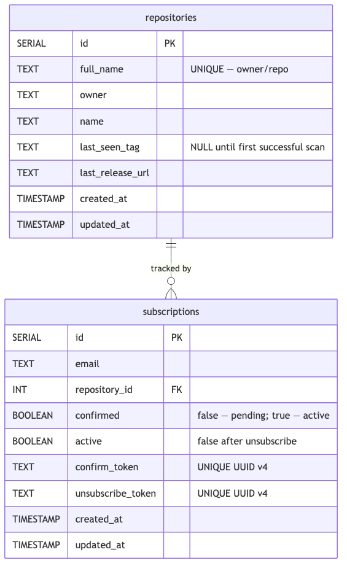

# [ADR-003] Repository Deduplication — Shared Repository Records Across Subscribers

| | |
|---|---|
| **Status** | Proposed \| **Accepted** \| Rejected \| Obsolete |
| **Author(s)** | Daria Ukshe |
| **Collaborators** | |
| **Created at** | 09 May 2025 |
| **Review deadline** | |
| **Approved at** | |
| **Epic** | CaseTaskNotifier — GitHub Release Notification Service |

---

## Context

Multiple subscribers can subscribe to the same GitHub repository. The system must decide how to model this relationship in the database and how to coordinate GitHub API calls during the scan cycle.

Two questions arise from this:

1. **Data model** — should repository metadata (`owner`, `name`, `last_seen_tag`) be stored once per repository or once per subscription?
2. **API call strategy** — should the scanner call the GitHub API once per repository per scan cycle, or once per subscriber?

The answer to question 1 directly determines the answer to question 2. With a shared repository record, the scanner can deduplicate API calls by grouping subscriptions by `repository_id` before querying GitHub. Without it, each subscriber for the same repository would require a separate API call.

Given that GitHub's authenticated rate limit is 5,000 requests per hour, the choice between these models significantly affects how many repositories the service can track at a given scan interval.

---

## Overview

### Current Implementation — Shared `repositories` Table

A dedicated `repositories` table stores one record per unique `owner/repo` combination. The `subscriptions` table references it via a foreign key `repository_id`.

```sql
CREATE TABLE repositories (
    id            SERIAL PRIMARY KEY,
    full_name     TEXT UNIQUE NOT NULL,
    owner         TEXT NOT NULL,
    name          TEXT NOT NULL,
    last_seen_tag TEXT,
    last_release_url TEXT,
    created_at    TIMESTAMP NOT NULL DEFAULT NOW(),
    updated_at    TIMESTAMP NOT NULL DEFAULT NOW()
);

CREATE TABLE subscriptions (
    id            SERIAL PRIMARY KEY,
    email         TEXT NOT NULL,
    repository_id INT NOT NULL REFERENCES repositories(id),
    ...
);

CREATE UNIQUE INDEX idx_email_repo ON subscriptions(email, repository_id);
CREATE INDEX idx_subscriptions_repository_id ON subscriptions(repository_id);
```

During the scan cycle, subscriptions are grouped by `repository_id` before iterating. This results in exactly **one GitHub API call per repository per cycle**, regardless of how many subscribers that repository has.

```
1,000 subscribers across 500 repositories → 500 GitHub API calls per cycle
```

The `last_seen_tag` field lives on the `repositories` record — it represents the last known release for that repository across all subscribers. When a new release is detected, all subscribers of that repository are notified in a single loop, and `last_seen_tag` is updated once.

**Database schema:**



### Alternative — Repository Data Stored Per Subscription

Store `owner`, `name`, and `last_seen_tag` directly on the `subscriptions` table, eliminating the separate `repositories` table.

```
1,000 subscribers across 500 repositories → 1,000 GitHub API calls per cycle
```

---

## Decisions

**Option A — Shared `repositories` table with foreign key (chosen)**

Maintain a normalized `repositories` table with a `UNIQUE` constraint on `full_name`. Each subscription references a repository by `repository_id`. The scanner groups subscriptions by `repository_id` and makes one GitHub API call per group.

Upsides: GitHub API calls scale with the number of unique repositories, not the number of subscribers — at 500 repos and a 10-minute interval this is 3,000 req/hour, well within the 5,000/hour limit; `last_seen_tag` is a single source of truth shared across all subscribers of a repository; repository metadata is stored once and is consistent; adding new subscribers to an already-tracked repository does not increase API usage.

Downsides: requires a join between `subscriptions` and `repositories` in the scanner query; `FindByFullName` lookup on subscribe must handle the upsert case (create repository if not yet tracked); slightly more complex data model than a flat subscriptions table.

**Option B — Repository data embedded in each subscription row**

Store `owner`, `name`, and `last_seen_tag` directly in the `subscriptions` table. No separate `repositories` table.

Upsides: simpler schema — single table, no joins needed.

Downsides: GitHub API is called once per subscriber per cycle rather than once per repository — with 1,000 subscribers across 500 repos this doubles the API usage; `last_seen_tag` must be updated on every subscription row for a given repository when a new release is detected — N writes instead of one; data denormalization means `last_seen_tag` can drift between rows for the same repository if any update fails; as subscriber count grows, API usage grows proportionally and will hit the rate limit sooner.

**Option C — No persistent repository tracking; always fetch and compare in memory**

Do not store `last_seen_tag` in the database. On each scan cycle, fetch the latest release for every tracked repository and compare against an in-memory cache that resets on service restart.

Upsides: no `repositories` table or `last_seen_tag` column needed.

Downsides: on service restart, the in-memory state is lost — the first scan after restart would treat every release as "new" and send a notification wave to all subscribers; not suitable for a production notification service; still does not solve the N API calls per N subscribers problem.

### Decision

It was decided to go with **Option A**. A shared `repositories` table is the correct normalized data model for a one-to-many relationship between repositories and subscribers. The primary benefit is API call deduplication — the number of GitHub API requests per scan cycle is bounded by the number of unique tracked repositories, not the number of subscribers. This is a critical constraint given GitHub's 5,000 req/hour rate limit. Options B and C were ruled out: B scales poorly with subscriber growth and introduces data consistency risks, and C loses state across restarts making it unsuitable for a notification service.

---

## Consequences

1. The scanner makes exactly one GitHub API call per unique repository per cycle, regardless of subscriber count. API usage scales with repository count, not subscriber count.
2. `last_seen_tag` and `last_release_url` are stored once per repository and updated atomically after notifications are sent — no risk of partial updates across subscriber rows.
3. On subscribe, the service performs a `FindByFullName` lookup and creates a repository record only if one does not already exist — the `UNIQUE` constraint on `full_name` prevents duplicates.
4. The `idx_subscriptions_repository_id` index on `subscriptions(repository_id)` makes the grouping query efficient as subscriber count grows.
5. A subscriber joining an already-tracked repository does not trigger an additional GitHub API call and immediately inherits the existing `last_seen_tag` baseline.

---

## Infrastructure

1. `repositories` table introduced in migration `000001_init.up.sql` with `UNIQUE (full_name)` constraint.
2. `UNIQUE INDEX idx_email_repo ON subscriptions(email, repository_id)` — prevents duplicate subscriptions.
3. `INDEX idx_subscriptions_repository_id ON subscriptions(repository_id)` — supports efficient grouping in scanner.
4. `GitHubRepository` interface provides `FindByFullName`, `Create`, `GetByID`, `UpdateLastSeenTag` — used by both the subscription service and the scanner.
