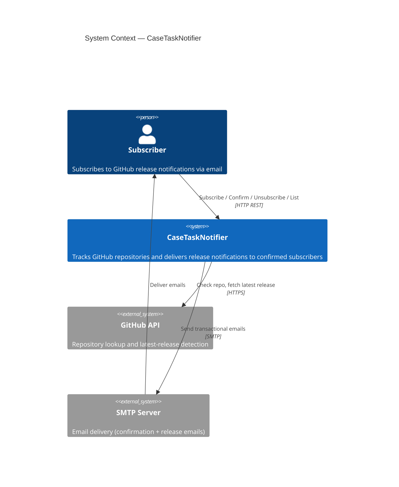
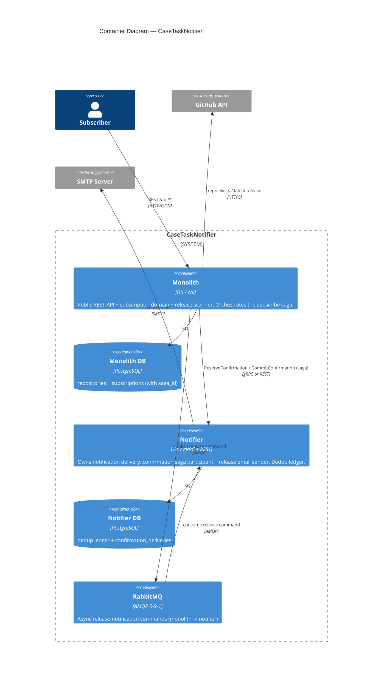
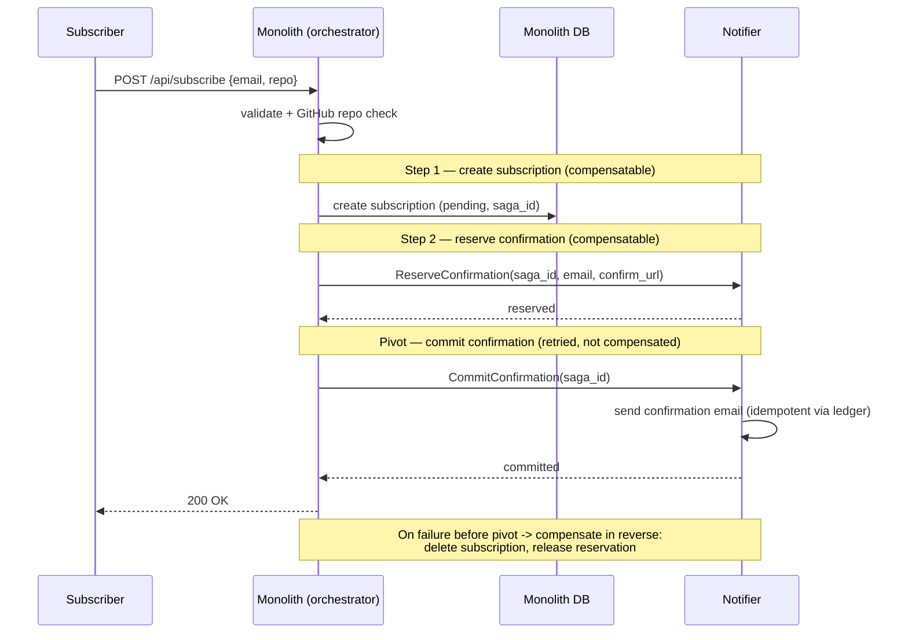
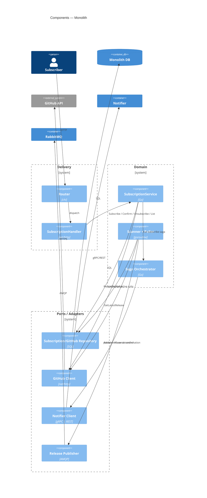
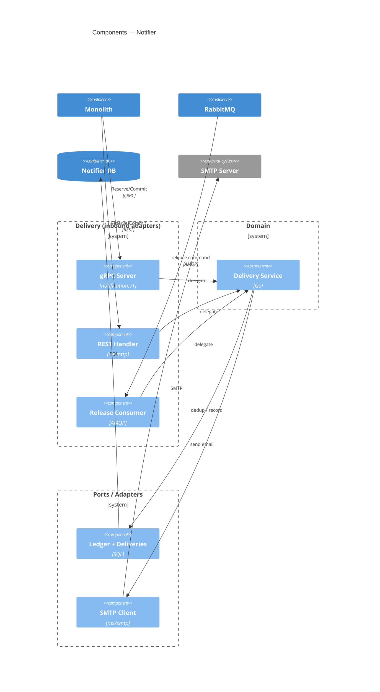

# Architecture — CaseTaskNotifier

This document describes the **current** architecture of the system as it stands after
hw6–hw9: the original layered monolith plus an extracted **notifier** microservice, an
asynchronous **RabbitMQ** channel for release notifications, an orchestrated **Saga** for
the subscribe flow, and a **gRPC/REST** transport toggle for the synchronous
confirmation call.

For the earlier single-process design see [SD/SYSTEM_DESIGN.md](SD/SYSTEM_DESIGN.md).
Architectural decisions are recorded under [ADR/](ADR/).

---

## 1. System Context (C4 — Level 1)



---

## 2. Containers (C4 — Level 2)

The system is split into two deployable services communicating over gRPC/REST
(synchronous, confirmation) and RabbitMQ (asynchronous, release fan-out). Each service
owns its **own** PostgreSQL database.



**Why two services.** Notification delivery has different scaling and failure
characteristics than the subscription API (slow SMTP, retries, dedup). Extracting it
(hw6) isolates that concern behind a contract and lets it own its dedup ledger.

---

## 3. Communication styles

| Flow | Transport | Sync/Async | Rationale |
|---|---|---|---|
| Subscribe -> send confirmation email | gRPC **or** REST (`NOTIFIER_TRANSPORT`) | Sync | Part of the subscribe saga; caller needs the outcome to commit/compensate |
| New release -> notify subscribers | RabbitMQ (AMQP) | Async | Fan-out, tolerant to notifier downtime; monolith must not block on SMTP |

The confirmation call runs over **two transports side by side** (hw9) against the same
`delivery.Service` — see the throughput comparison in the [README](../README.md#grpc-vs-rest--transport-comparison).

---

## 4. The Subscribe Saga (hw8)

Subscribe spans two services, so it runs as an **orchestrated saga** with reverse-order
compensation. The confirmation delivery is the **pivot** step: it is retried rather than
compensated (roll-forward), because once we commit to notifying we don't "un-notify".



Orchestrator: [`internal/saga/orchestrator.go`](../internal/saga/orchestrator.go).
Notifier participant: [`notifier/internal/delivery/service.go`](../notifier/internal/delivery/service.go),
deduplicated by the ledger + `confirmation_deliveries` table.

---

## 5. Layered structure

Both services follow the same layering. Each package is assigned to exactly one layer,
and the allowed dependencies between layers are **enforced by tests** — see
[§9 Enforced invariants](#9-enforced-invariants-architecture-tests).

```
delivery ──▶ domain ──▶ ports (interfaces)
                              ▲
                              └── adapters (implement ports)
   everything wired together only in app (composition root)
```

Following Go idiom, a port interface is declared next to its consumer or its
implementation, so a domain package (e.g. `release`) may import an adapter package
(e.g. `repository`) **for its interface type**, never for its concrete constructor —
concrete adapters are instantiated only in the composition root. The invariants the
tests actually guarantee are: the domain never depends on the delivery layer or the
composition root, the delivery layer never reaches adapters directly, the two services
only ever cross the boundary through the shared `contract`/`gen`, and the notifier's
domain stays transport-agnostic.

### 5.1 Monolith (`internal/`)

| Layer | Packages | Responsibility |
|---|---|---|
| Composition root | `app`, `main/` | Config load, DB, DI wiring, server + scanner lifecycle |
| Delivery | `http/router`, `http/handlers`, `http/dto`, `http/metrics` | REST endpoints, JSON (de)serialization, error -> status mapping |
| Domain | `subscription`, `release`, `scanner`, `saga` | Subscription lifecycle, release detection, saga orchestration |
| Ports / adapters | `repository`, `github`, `client/notification`, `notification/publisher`, `mailer` | PostgreSQL, GitHub client, notifier client (gRPC+REST), RabbitMQ publisher |
| Shared | `config`, `logger`, `metrics`, `token`, `urlbuilder`, `validator` | Cross-cutting utilities |

The notifier is reached only through the `client/notification` adapter, which the
`subscription` service consumes as a `ConfirmationNotifier` interface — the domain has no
knowledge of gRPC vs REST.

### 5.2 Notifier (`notifier/`)

| Layer | Packages | Responsibility |
|---|---|---|
| Composition root | `internal/app`, `main/` | Config, DB, DI wiring, gRPC + REST + consumer + metrics lifecycle |
| Delivery | `internal/server` (gRPC), `internal/rest` (REST), `internal/consumer` (AMQP) | Three inbound adapters over the **same** service |
| Domain | `internal/delivery` | Confirmation saga participant + release sending, idempotency |
| Ports / adapters | `internal/store` (ledger, deliveries), `internal/smtp` | PostgreSQL dedup state, SMTP sender |
| Contract | `contract/`, `proto/`, `gen/` | Protobuf contract + generated stubs shared as the service boundary |

All three inbound adapters (gRPC / REST / AMQP) funnel into one `delivery.Service`, so the
transport is a detail and business rules live in exactly one place.

---

## 6. Component wiring (C4 — Level 3, per service)





---

## 7. Data ownership

| Store | Owner | Contents |
|---|---|---|
| Monolith DB | Monolith | `repositories` (last_seen_tag), `subscriptions` (confirmation status, tokens, `saga_id`) |
| Notifier DB | Notifier | dedup `ledger`, `confirmation_deliveries` (idempotency keys) |

Each service owns its schema; there are no cross-service database reads. State crosses the
boundary only through the gRPC/REST contract and RabbitMQ messages.

---

## 8. Key decisions (see ADRs)

| Decision | Where |
|---|---|
| Polling GitHub for releases | [ADR-001](ADR/ADR-001-release-scanning-strategy.md) |
| Double opt-in confirmation | [ADR-002](ADR/ADR-002-double-opt-in-subscription.md) |
| Repository-level dedup | [ADR-003](ADR/ADR-003-repository-deduplication.md) |
| Notifier as a microservice | git history hw6 (`feat: add notification gRPC microservice`) |
| RabbitMQ for release fan-out | git history hw7 (`feat: publish release notifications to rabbitmq`) |
| Orchestrated saga w/ pivot | git history hw8 (`feat: run subscribe as an orchestrated saga`) |
| gRPC/REST transport toggle | README section "gRPC vs REST" (hw9) |

---

## 9. Enforced invariants (architecture tests)

The layering above is not just documentation — it is verified on every `go test` run by
[`internal/arch/arch_test.go`](../internal/arch/arch_test.go). The test parses the imports
of every non-test `.go` file in the module, assigns each package to a layer, and asserts
a dependency matrix. This keeps the diagrams and the code from drifting apart.

### Layer map

| Layer | Monolith packages | Notifier packages |
|---|---|---|
| composition root | `internal/app` | `notifier/internal/app` |
| delivery | `internal/http/*` | `internal/server`, `internal/rest`, `internal/consumer` |
| domain | `subscription`, `release`, `scanner`, `saga` | `internal/delivery` |
| adapters | `repository`, `github`, `client/notification`, `notification/publisher` | `internal/store`, `internal/smtp` |
| kernel / shared | `repo`, `token`, `urlbuilder`, `validator`, `metrics`, `logger`, `config`, `mailer` | `internal/config`, `internal/metrics` |
| contract (shared boundary) | — | `notifier/contract`, `notifier/gen` |

### Enforced rules

| Test | Rule |
|---|---|
| `TestEveryInternalPackageHasALayer` | Every `internal/…` package is assigned to a layer — a new unclassified package fails the build until it is placed. |
| `TestLayerDependencyRules` | Imports must obey the allowed-dependency matrix (e.g. domain may not import delivery or the composition root; delivery may not import adapters). |
| `TestServiceBoundaryIsContractOnly` | The monolith must not import `notifier/internal/*` and the notifier must not import the monolith's `internal/*` — the only legal crossing is `notifier/contract` / `notifier/gen`. |
| `TestNotifierDomainHasNoInternalDeps` | `notifier/internal/delivery` (domain) may import nothing but the contract, so business rules stay independent of gRPC/REST/AMQP. |
| `TestCompositionRootImportedOnlyByMain` | Only `main` may import `internal/app` (same for the notifier) — nothing depends on the wiring. |

Run them with:

```bash
go test ./internal/arch/ -v
```
