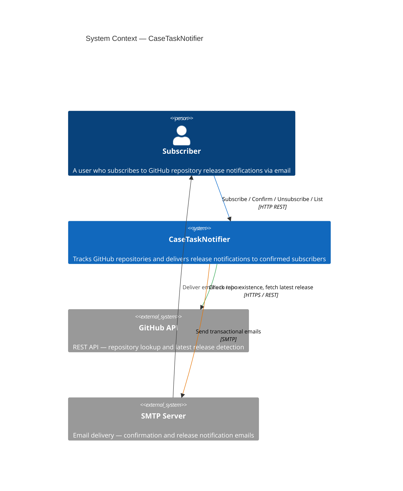
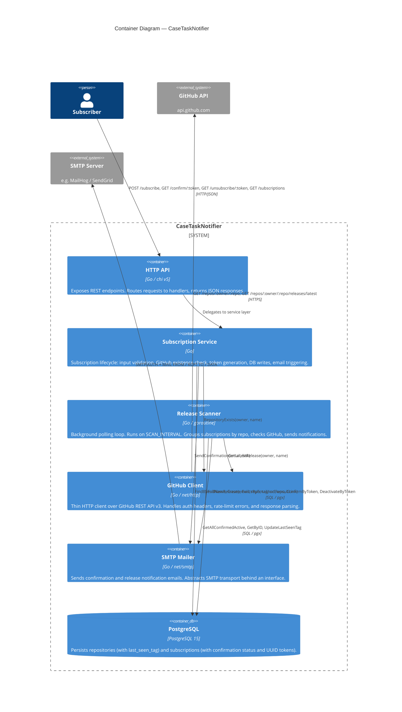
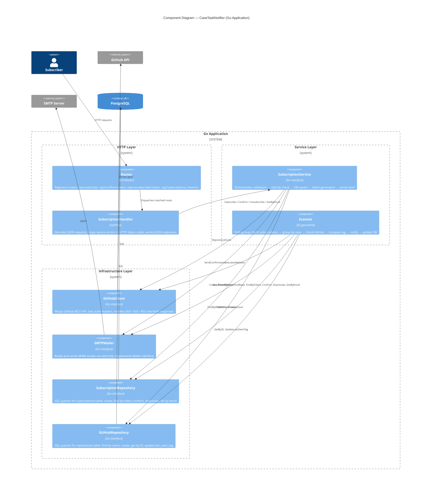
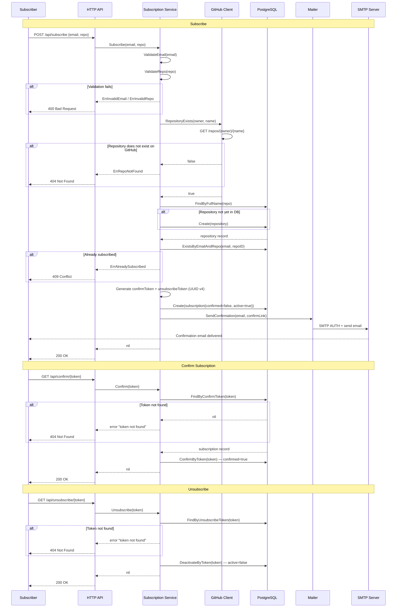
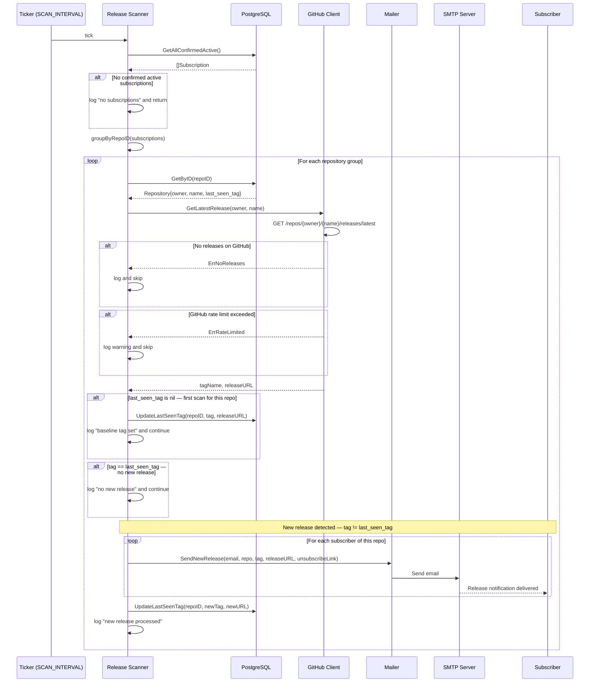
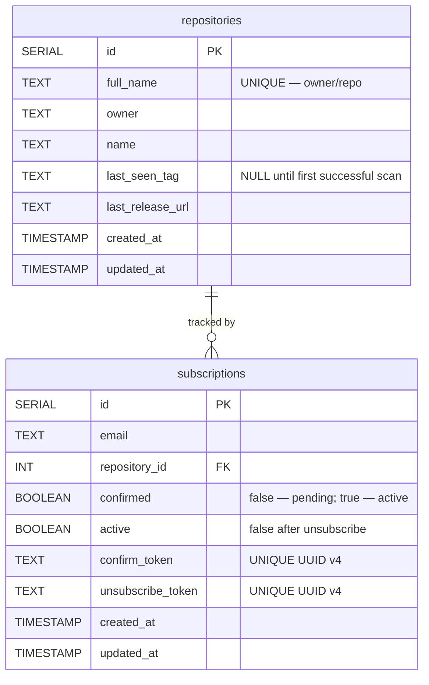

# System Design — CaseTaskNotifier

## Overview

CaseTaskNotifier is a Go-based backend service that lets users subscribe to email notifications for new releases of GitHub repositories. The system polls the GitHub API on a configurable interval and sends notifications via SMTP when a new release is detected.

---

## 1. System Requirements

### Functional Requirements

| # | Requirement |
|---|---|
| FR-1 | User can subscribe to a GitHub repository (`owner/repo` format) using their email |
| FR-2 | System validates that the repository exists on GitHub before creating a subscription |
| FR-3 | Subscription is confirmed via a double opt-in link sent to the user's email |
| FR-4 | User can unsubscribe at any time using a unique link included in every notification |
| FR-5 | User can list their active subscriptions by email |
| FR-6 | System periodically polls GitHub API and detects new releases |
| FR-7 | On new release detection, all confirmed subscribers of that repository receive an email notification |
| FR-8 | Each repository is polled once per scan cycle regardless of subscriber count |

### Non-Functional Requirements

| # | Requirement | Target |
|---|---|---|
| NFR-1 | **Availability** | Service recovers from transient GitHub API / SMTP failures without crashing |
| NFR-2 | **Fault Tolerance** | All outbound HTTP calls use `context.WithTimeout`; rate-limit errors are logged and skipped |
| NFR-3 | **Observability** | Structured logging via `slog`; Prometheus metrics exposed at `/metrics` |
| NFR-4 | **Maintainability** | Layered architecture (Handler → Service → Repository); all external dependencies behind interfaces |
| NFR-5 | **Testability** | Business logic testable in isolation via mocked interfaces |
| NFR-6 | **Data Integrity** | Unique index on `(email, repository_id)` prevents duplicate subscriptions; UUID tokens prevent enumeration |
| NFR-7 | **Configurability** | Scan interval, SMTP, DB, and GitHub token configurable via environment variables |

---

## 2. Load Assessment

### Traffic

| Metric | Estimate | Notes |
|---|---|---|
| Daily Active Subscribers | 1,000 | |
| Inbound API requests | ~3,000 / day (~0.04 RPS) | Subscribe, confirm, unsubscribe, list |
| Tracked repositories | 500 unique | |
| Scan interval | 5 min (configurable) | |
| GitHub API calls | 500 repos × 12 scans/hour = **6,000 req/hour** | See rate limit analysis below |
| Peak notification spike | ~1,000 emails | All subscribers notified on a popular repo release |

### GitHub API Rate Limit Analysis

GitHub allows **5,000 authenticated requests/hour** per token.

| Scan Interval | Repos | API calls/hour | Within limit? |
|---|---|---|---|
| 5 min | 500 | 6,000 | **No** — exceeds limit |
| 10 min | 500 | 3,000 | Yes |
| 5 min | 400 | 4,800 | Yes (marginal) |

With the default 5-minute interval the system hits the GitHub rate limit at ~416 tracked repositories. The scanner handles `ErrRateLimited` gracefully by logging and skipping the affected repo until the next cycle. For production use, a longer scan interval or per-repository request spreading would be required.

### Data Storage

| Table | Rows | Row size | Total |
|---|---|---|---|
| `repositories` | 500 | ~250 B | ~125 KB |
| `subscriptions` | 1,000 | ~350 B | ~350 KB |
| Indexes (B-tree) | — | — | ~500 KB |
| **Total DB** | | | **< 1 MB** |

The database footprint is negligible at this scale. PostgreSQL is not a storage bottleneck.

### Bandwidth

| Direction | Volume |
|---|---|
| Inbound (API requests) | < 1 KB/request → negligible |
| GitHub API outbound | 6,000 req/hour × ~2 KB = ~12 MB/hour |
| SMTP outbound (notification spike) | 1,000 emails × ~5 KB = ~5 MB |

---

## 3. Architecture

### Level 1 — System Context

Who interacts with the system and what external systems it depends on.

---

### Level 2 — Containers

Internal containers and their responsibilities.

---

### Level 3 — Components

Internal components of the Go application and how they are wired together.

---

## 4. Sequence Diagrams

### Subscription Flow

Full lifecycle: subscribe → confirm → (optionally) unsubscribe.

---

### Release Scan Flow

Background goroutine; fires on every `SCAN_INTERVAL` tick.

---

## 5. Database Schema

**Indexes:**
- `UNIQUE (full_name)` on `repositories` — fast lookup on subscribe
- `UNIQUE (email, repository_id)` on `subscriptions` — prevents duplicate subscriptions
- `INDEX (repository_id)` on `subscriptions` — fast grouping in scanner

---

## 6. Detailed Component Design

### HTTP Layer

**Router** (`internal/http/router/router.go`)

Registers all routes using `chi.Router`. Also mounts the Prometheus `/metrics` handler.

| Method | Path | Handler |
|---|---|---|
| POST | `/api/subscribe` | `SubscriptionHandler.Subscribe` |
| GET | `/api/confirm/{token}` | `SubscriptionHandler.Confirm` |
| GET | `/api/unsubscribe/{token}` | `SubscriptionHandler.Unsubscribe` |
| GET | `/api/subscriptions?email=` | `SubscriptionHandler.GetSubscriptions` |
| GET | `/metrics` | `promhttp.Handler()` |

**SubscriptionHandler** (`internal/http/handlers/subscription_handler.go`)

Responsibilities:
- Decode JSON request bodies
- Extract URL/query parameters
- Map service-layer errors to HTTP status codes (`400`, `404`, `409`, `500`)
- Write JSON responses

---

### Subscription Service

**SubscriptionService** (`internal/service/subscription_service.go`)

Orchestrates the subscription lifecycle. Accepts `SubscriptionRepository`, `GitHubRepository`, `github.Client`, and `Mailer` as constructor dependencies (dependency injection via interfaces).

Key operations:

| Method | Steps |
|---|---|
| `Subscribe` | Validate → GitHub check → DB upsert repo → check duplicate → create subscription → send confirmation email |
| `Confirm` | Find by token → mark `confirmed=true` |
| `Unsubscribe` | Find by token → mark `active=false` |
| `GetSubscriptionsByEmail` | Query active subs → enrich with repo data |

---

### Release Scanner

**Scanner** (`internal/scanner/scanner.go`)

Runs as a background goroutine started at application boot. Fires immediately on start, then on every `SCAN_INTERVAL` tick.

Key design points:
- Fetches **all** confirmed and active subscriptions in one query
- Groups by `repository_id` — ensures **one GitHub API call per repo per cycle**, not one per subscriber
- Sets a baseline `last_seen_tag` on first encounter (no notification sent)
- On new release: notifies all subscribers sequentially, then updates `last_seen_tag`
- Handles `ErrNoReleases` and `ErrRateLimited` gracefully — logs and skips without crashing

---

### GitHub Client

**GitHubClient** (`internal/github/client.go`)

Thin wrapper over `net/http` against `api.github.com`. Implements the `github.Client` interface.

| Method | GitHub endpoint | Purpose |
|---|---|---|
| `RepositoryExists` | `GET /repos/{owner}/{repo}` | Validates repo on subscribe |
| `GetLatestRelease` | `GET /repos/{owner}/{repo}/releases/latest` | Fetches latest tag for scanner |

Error handling:
- `404` → `ErrNotFound` / `ErrNoReleases`
- `403` + `X-RateLimit-Remaining: 0` or `429` → `ErrRateLimited`
- Sets `Authorization: Bearer <token>` and `X-GitHub-Api-Version: 2022-11-28` headers when token is configured

---

### Mailer

**SMTPMailer** (`internal/mailer/smtp_mailer.go`)

Implements the `Mailer` interface. Connects to SMTP server using credentials from environment variables.

| Method | Triggered by | Content |
|---|---|---|
| `SendConfirmation` | `SubscriptionService.Subscribe` | Confirmation link with `confirm_token` |
| `SendNewRelease` | `Scanner` | Release tag, release URL, unsubscribe link |

Decoupled behind a `Mailer` interface — allows swapping SMTP for another provider or a mock in tests.

---

### Repository Layer

**SubscriptionRepository** (`internal/repository/subscription_repository.go`)

SQL operations on the `subscriptions` table. All methods accept `context.Context` for cancellation and timeout propagation.

**GitHubRepository** (`internal/repository/github_repository.go`)

SQL operations on the `repositories` table. Stores `last_seen_tag` and `last_release_url` — the only mutable state updated by the scanner.

---

## 7. Key Design Decisions

| Decision | Choice | Rationale |
|---|---|---|
| Release detection | Polling (background goroutine) | No webhook infrastructure required; GitHub webhooks need a publicly accessible endpoint and app registration — too much overhead for this use case |
| Subscription confirmation | Double opt-in via UUID email token | Prevents fake subscriptions, protects third-party emails from being abused |
| Repo deduplication | Single `repositories` row per `owner/repo` | GitHub API is called once per repo per cycle regardless of subscriber count — avoids N×M API calls |
| Architecture | Layered monolith | Scale does not justify microservices; clean layer separation still allows future extraction |
| External dependencies | Behind Go interfaces | Enables unit testing with mocks; decouples business logic from infrastructure |
| Observability | `slog` + Prometheus `/metrics` | Standard library logging (no external SDK); metrics compatible with any Prometheus-based stack |
| Rate limit handling | Skip and log on `ErrRateLimited` | Graceful degradation — one failed repo does not abort the entire scan cycle |
